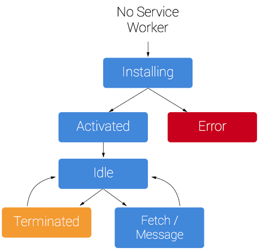

# React study

### E-commerce project (crwn-clothing)

네비게이션이 있고, 각 카테고리에 아이템들이 들어있다. 아이템 눌러서 카트에 담고 수량을 수정할 수 있다. 체크아웃 한 후에 결제창을 열어서 입력 후 페이할 수 있도록 만드는 것까지. 파이어베이스 사용해서 인증 이용 예정.

### css vs sass

(예제에서 보면 dependancy 버전이 안맞을때 에러가 날 수 있는데, 이때 나오는 지시사항을 따르면 해결)

1. Sass(Syntactically Awesome Style Sheets)는 css의 확장 언어, 상위집합(superset)
2. sass/scss를 사용하려고 node-sass 추가 (node-sass는 Node.js를 컴파일러인 LibSass에 바인딩한 라이브러리)
3. 웹에서 동작하는건 css이기 때문에, sass/scss로 작성 후 컴파일 하고 사용된다.

```css
$brand-color: #fc3;
a {
  color: $brand-color;
}
nav {
  background-color: $brand-color;
}
```

### scss vs sass

중괄호와 세미콜론의 유무

```sass
.list
  width: 100px
  float: left
  li
    color: red
    background: url("./image.jpg")
    &:last-child
      margin-right: -10px
```

```scss
.list {
  width: 100px;
  float: left;
  li {
    color: red;
    background: url("./image.jpg");
    &:last-child {
      margin-right: -10px;
    }
  }
}
```

[Sass(Scss)완전정복 참조 링크](https://heropy.blog/2018/01/31/sass/)

### package-lock.json

package-lock.json은 npm을 사용하여 package.json 파일을 또는 node_modules 트리를 수정하면 자동으로 생성되는 파일이다. 즉, 파일이 생성되는 시점의 의존성 트리에 대한 정보를 가지고 있다.

`필요한 이유`는 package.json 파일의 의존성 선언에는 version range가 사용되는데, 이는 특정 버전이 아니라 버전의 범위를 의미. 예를들면, npm i express를 실행하게 되면 package.json 파일에는 “^4.16.3”(Caret Ranges)로 버전 범위가 추가된다. 이 package.json 를 기반으로 npm i을 실행하면 현재는 4.16.3 버전이 설치 되지만 새로이express의 마이너 패치가 이루어진 버전이 퍼블리시 되어있다면 동일한 package.json파일로 npm i을 실행해도 4.16.4, 이나 4.17.1 같은 다른 버전이 설치될 수 있는 것이다. 간혹 업데이트된 버전이 오류를 발생시키는 경우가 있기 때문에 안정성을 위해 package-lock.json 필요

### serviceWorker.js

- 브라우저가 백그라운드에서 실행하는 스크립트
- 웹 페이지랑은 별개로 동작 -> DOM에 바로 접근할 수 없다
- 푸시 알림, 백그라운드 동기화 등을 사용하게 해준다
- 해당 API가 오프라인 환경을 완벽하게 통제할 수 있는 권한을 개발자에게 부여하고, 그 환경을 지원할 수 있도록 해준다
- 캐싱으로 로드를 빠르게 해줌으로써 웹사이트 성능을 높여준다.

`유의할 점은`

- 표준은 아님
- HTTPS 프로토콜만 사용 (The only exception here is when you run it in localhost.)
- 브라우저별로 다름으롷 확인하고 사용해야 한다
- 아래 그림과 같은 생명주기가 있음



<br/><br/>

## crwn-clothing

### components

App -> HomePage -> Directory -> MenuItem

### font

[Google fonts](https://fonts.google.com/)
index.html에 link로 import

### update packages

```
npm update -D // dev dependencies
npm audit // 사용하고 있는 모듈의 취약점(vulnerability을 알려줌
npm audit fix // 취약점을 가진 종속성에 대해 호환되는 버전으로 자동으로 업데이트를 해준다
```
